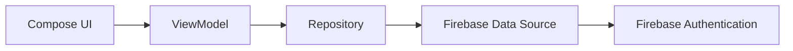
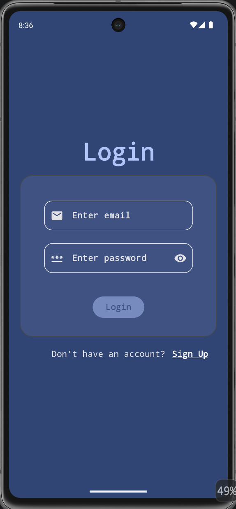
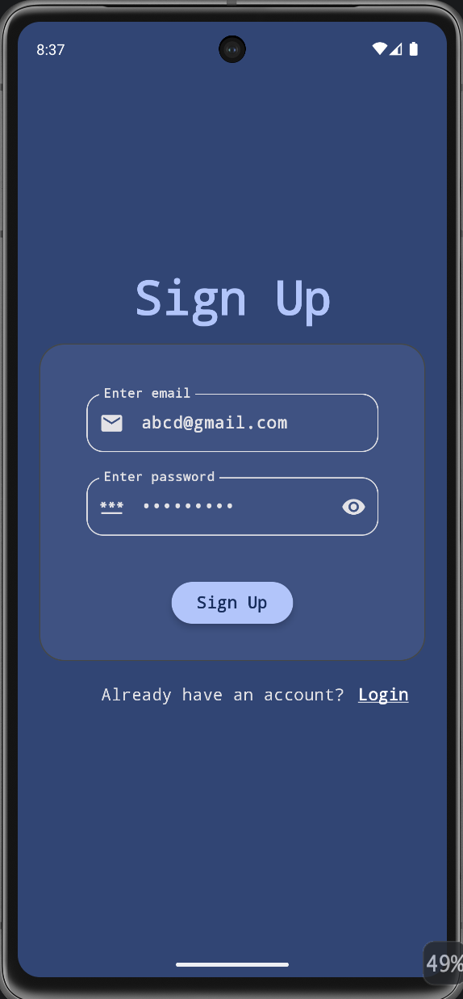
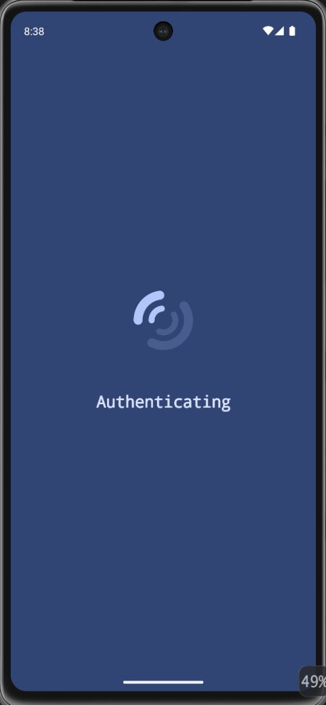
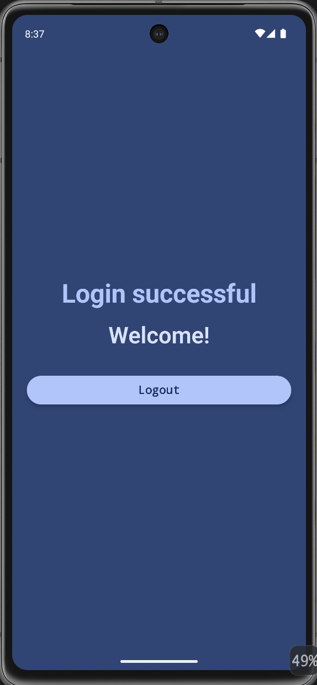

# 🔐 Authentication Lab

A modern Android authentication application built using **Kotlin**, **Jetpack Compose**, **MVVM**, and **Firebase Authentication**.

This project demonstrates a production-inspired authentication flow with clean architecture principles, reactive UI using StateFlow & SharedFlow, and proper separation of concerns. It serves as both a learning project and a portfolio application showcasing Android development best practices.

---

# 📱 App Overview

This is an Android application that demonstrates how to build a scalable authentication system using Firebase Authentication and Jetpack Compose.

Instead of simply implementing login functionality, this project focuses on building authentication using real-world Android architecture with proper separation between UI, business logic, and data layers.

### Problem it solves

Many beginner authentication projects tightly couple Firebase APIs with UI code, making them difficult to maintain and extend.

This project demonstrates a clean and scalable approach using MVVM, Repository Pattern, Data Source abstraction, reactive state management, and centralized UI event handling.

---

# ✨ Features

- ✅ User Registration using Email & Password
- ✅ User Login
- ✅ User Logout
- ✅ Session Persistence
- ✅ Automatic Authentication State Detection
- ✅ Reactive UI using StateFlow
- ✅ One-time UI Events using SharedFlow
- ✅ Centralized Snackbar Handling
- ✅ Firebase Exception Mapping to User-Friendly Messages
- ✅ Repository Pattern
- ✅ Data Source Layer
- ✅ Clean Separation of Concerns
- 🚧 Email & Password Validation (Planned)
- 🚧 Forgot Password (Planned)
- 🚧 Google Sign-In (Planned)

---

# 🛠 Tech Stack

### Language

- Kotlin

### UI

- Jetpack Compose
- Material 3

### Architecture

- MVVM
- Repository Pattern
- Data Source Pattern

### Asynchronous Programming

- Kotlin Coroutines
- StateFlow
- SharedFlow

### Backend

- Firebase Authentication

### Other Libraries

- AndroidX Lifecycle
- Kotlin Flow
- Firebase KTX

---

# 🏗 Architecture

The application follows the MVVM architecture with a Repository and Data Source layer to keep Firebase implementation details isolated from the UI.



### Layer Responsibilities

**UI**

- Displays state
- Sends user actions to ViewModel
- Observes StateFlow and SharedFlow

**ViewModel**

- Business logic
- State management
- UI event emission
- Authentication flow

**Repository**

- Converts Firebase models into application models
- Handles authentication operations

**Data Source**

- Direct communication with Firebase Authentication SDK

---

# 🔄 App Flow

1. User launches the application.
2. Existing authentication session is checked.
3. If authenticated, user is navigated to the Home screen.
4. Otherwise, Login screen is displayed.
5. User can Login or Register using Email & Password.
6. Authentication request is sent to Firebase.
7. Repository maps Firebase models into application models.
8. ViewModel updates authentication state.
9. UI reacts automatically to state changes.
10. Errors are displayed using centralized Snackbars.

---

---

# 📸 Screenshots

| Login | Register | Loading | Home |
|-------|----------|---------|------|
|  |  |  |  |

---

---

# 🌐 API Integration

### Firebase Authentication

Used for:

- User Registration
- User Login
- User Logout
- Session Persistence

### Data Flow

```
UI
 ↓
ViewModel
 ↓
Repository
 ↓
Firebase Data Source
 ↓
Firebase Authentication
```

### Error Handling

- Firebase exceptions are mapped into user-friendly messages.
- Errors are emitted as one-time UI events using SharedFlow.
- Snackbars are displayed from a centralized location in the application.

---

# 📂 Project Structure

```
app
│
├── auth
│   ├── data
│   │   ├── model
│   │   ├── remote
│   │   └── repository
│   │
│   ├── presentation
│   │   ├── authstate
│   │   ├── event
│   │   ├── viewmodel
│   │   └── ui
│
├── navigation
│
├── ui
│   └── theme
│
└── MainActivity.kt
```

---

# 🎯 Use Cases

This project demonstrates:

- Firebase Authentication implementation
- Modern Android architecture
- Reactive UI development
- Repository Pattern
- StateFlow & SharedFlow usage
- Production-inspired authentication flow

Useful for:

- Android Developers
- Students learning Firebase
- Portfolio Showcase
- Interview Preparation
- MVVM Practice

---

# 🚧 Future Improvements

- Email Validation
- Password Strength Validation
- Confirm Password
- Forgot Password
- Google Sign-In
- Email Verification
- Password Visibility Animation
- Remember Me
- Biometric Authentication
- Hilt Dependency Injection
- Unit Testing
- UI Testing
- Offline Authentication Cache
- Multi-Factor Authentication (MFA)

---

# 📚 Learning Highlights

This project focuses on understanding **why** architectural decisions are made instead of simply implementing authentication.

Concepts explored include:

- MVVM Architecture
- Repository Pattern
- Data Source Pattern
- State vs Events
- StateFlow vs SharedFlow
- Firebase Model Mapping
- Separation of Concerns
- Clean Code Practices
- Reactive UI with Jetpack Compose

---

# 🤝 Portfolio

This project is part of my Android Development portfolio and showcases modern Android development practices with Jetpack Compose and Firebase.

I'm continuously improving this project by adding new authentication features and refining the architecture.

---

# 💼 Freelancing

I'm currently open to freelance Android development opportunities.

If you'd like to collaborate or discuss a project, feel free to connect with me.

---

# ⭐ Support

If you found this project helpful, consider giving it a ⭐ on GitHub!

It helps support my work and motivates me to continue building and sharing Android projects.
